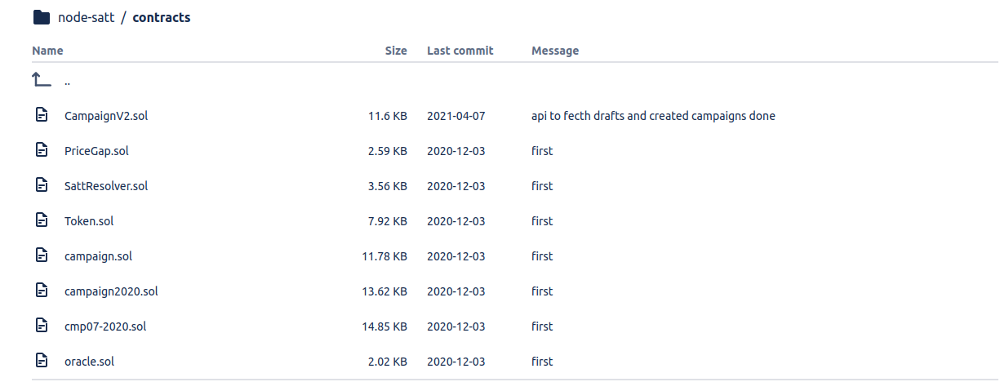
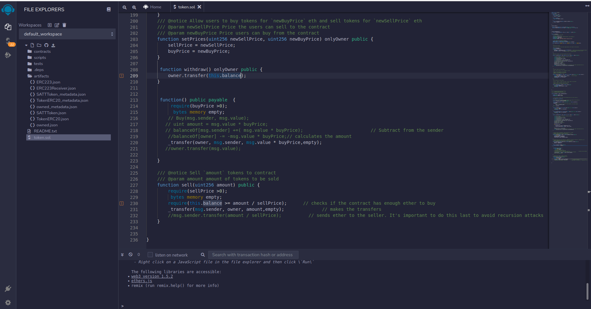
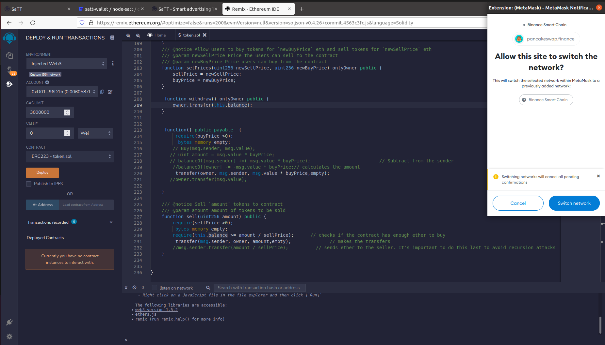
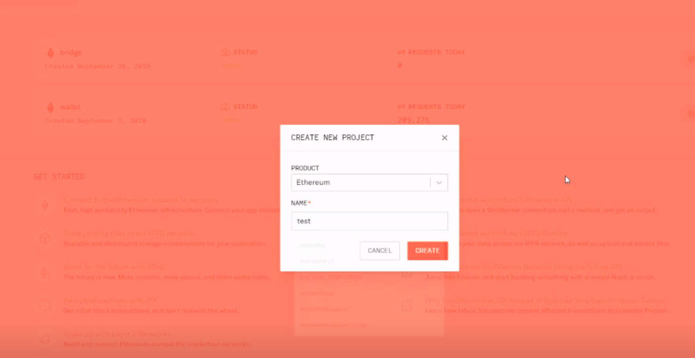
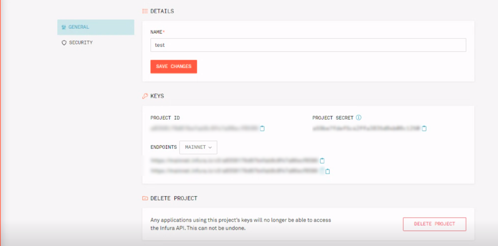

### Blockchain deployment


1. You can check all our differents smart contracts in contract folder:




2. To Deploy smart contracts (token,campaign and oracle) in contract folder with [Remix](https://remix.ethereum.org) and [Metamask](https://metamask.io/) or [MEW](https://www.myetherwallet.com/):

**create your file on Remix and paste your code there



**Compile your file.sol and check


**To deploy your smart contract you should connect with your metamask account 



3. To create node, Web3 service provider with [Geth](https://geth.ethereum.org/),[openethereum](https://github.com/openethereum/openethereum) or [Infura](https://infura.io/) SaaS

**Create new Ethereum app





**Get node credentials from infura such as PROJECTID, PROJECT SECRET, and the endpoints that we can use to connect to infura node(https, wss)




PS: This credential refers to in WEB3_URL .env file
```sh
WEB3_URL=process.env.WEB3_URL
```


You can also install Geth Node you can follow this [Guide](https://geth.ethereum.org/docs/getting-started) or [Parity](https://openethereum.github.io/Setup)

4. on campaign contract call modToken(<token_address>,true)
5. on campaign contract call setOracle(<oracle_address>)
6. on oracle contract call changeAsk(<campaign_address>,true)
