# Social networks Configuration
<!--Facebook-->

 ## Facebook configuration


  To create a Facebook app you should visit [official developer.facebook.com website](https://developers.facebook.com/apps/) and respect the following steps:

  ### 1. Create an app


  ### 2. Confirm app creation


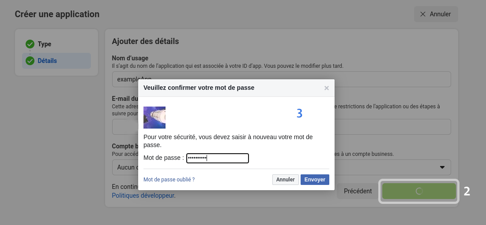


  ### 3. Get Facebook credentials


  ### 4. Get Facebook version


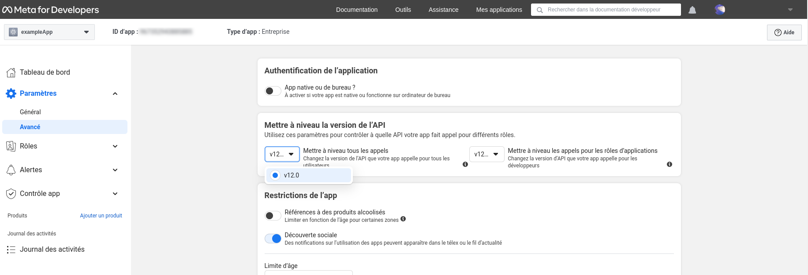


PS: 
All this credentials refers to APPID,APP_SECRET,FB_GRAPH_VERSION in .env file

```sh
APPID=process.env.APPID
APP_SECRET=process.env.APP_SECRET
FB_GRAPH_VERSION=process.env.FB_GRAPH_VERSION
```

- #### Google configuration

  To create a google app you should visit [official console.developers.google.com website](https://console.developers.google.com/) and respect the following steps:

  # Create Credentialds


  # Fill out the form

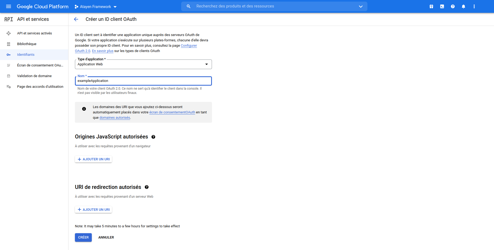


  # Get Client crededentials

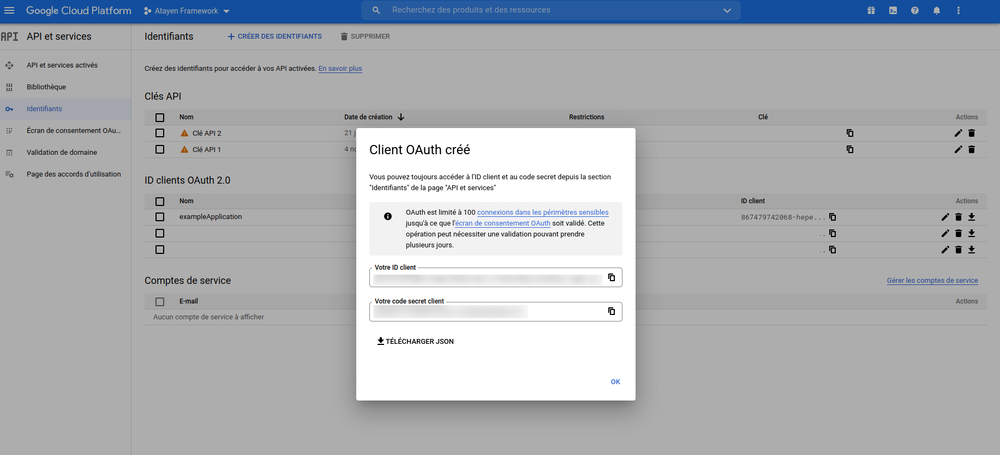


  # Create Youtube configuration

  


  # Get Youtube configuration

  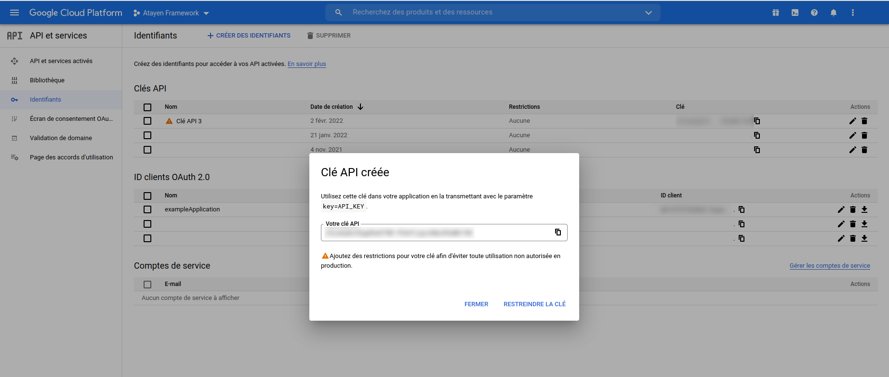


PS: 
All this credentials refers to GOOGLE_CLIENTID,GOOGLE_CLIENT_SECRET and GDA_TAP_API_KEY in .env file

```sh
GOOGLE_CLIENTID=process.env.GOOGLE_CLIENTID
GOOGLE_CLIENT_SECRET=process.env.GOOGLE_CLIENT_SECRET
GDA_TAP_API_KEY= process.env.GDA_TAP_API_KEY
```


- #### LinkedIN configuration

  To create a linkedin app you should visit [official developer.linkedin.com website](https://developer.linkedin.com/) and respect the following steps:

  # Create a new app

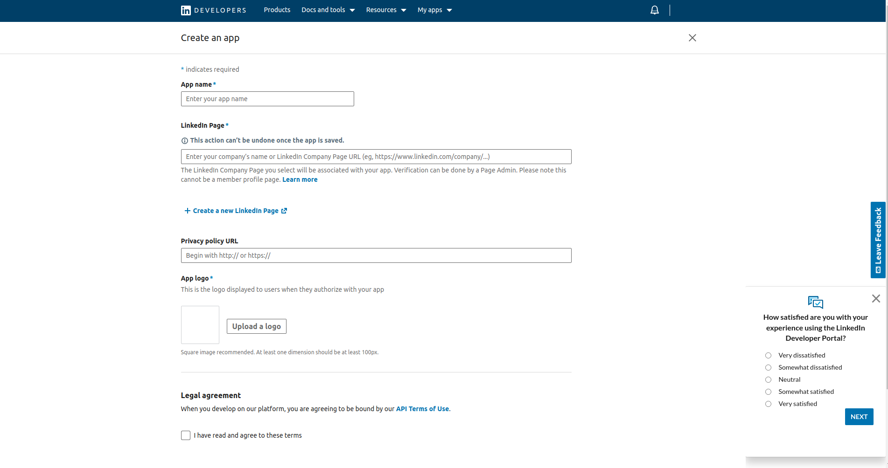


  # Get linkedin crededentials

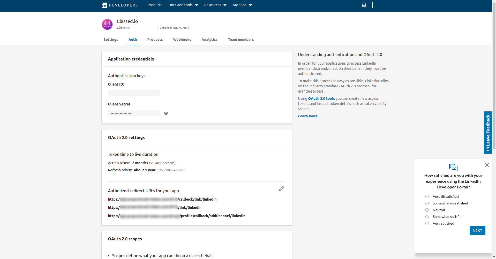


PS: 
All this credentials refers to LINKEDIN_KEY and LINKEDIN_SECRET in .env file

```sh
LINKEDIN_KEY=process.env.LINKEDIN_KEY
LINKEDIN_SECRET=process.env.LINKEDIN_SECRET
```


- #### Twitter  configuration

  To create a linkedin app you should visit [official  developers.twitter.com website](https://developer.twitter.com/) and respect the following steps:

  # Create a new app

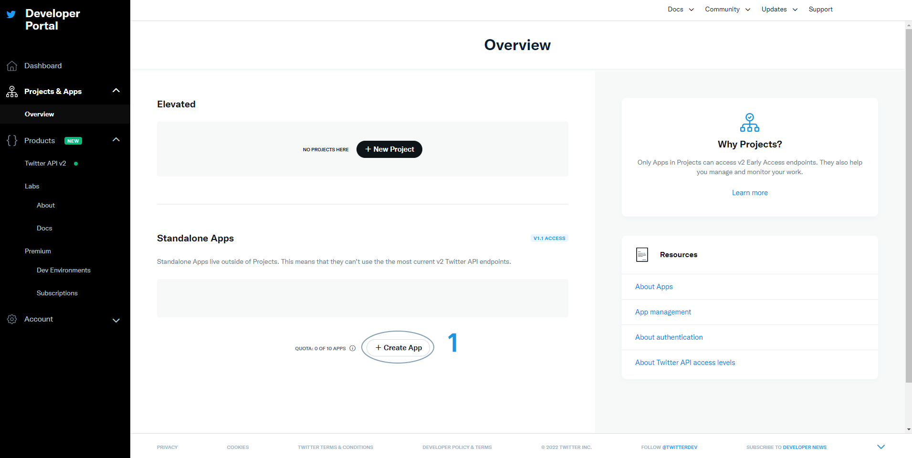


  # Set params for your app

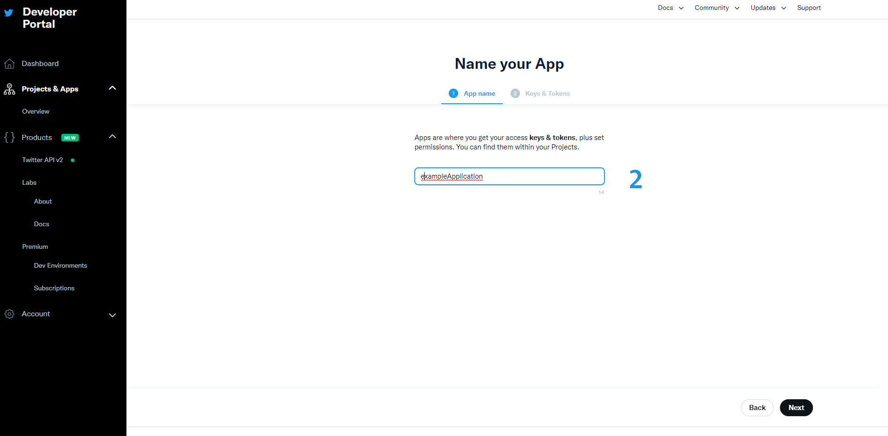


  # Get your twitter credentialds

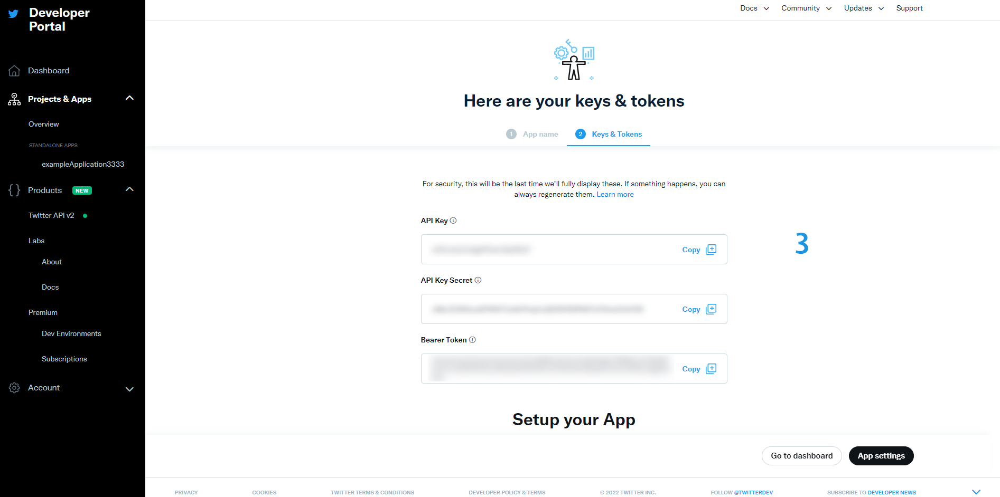


  # Get your twitter credentialds

  you can regenerate again your credentials with more options


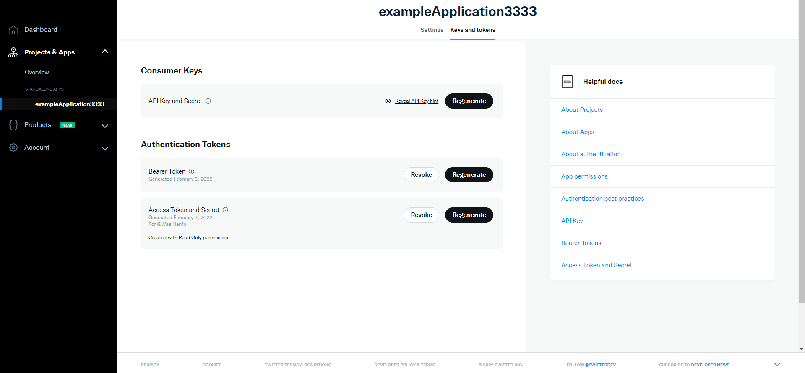


PS: 
All this credentials refers to TWITTER_CONSUMER_KEY_ALT, TWILTTER_CONSUMER_SECRET_ALT,TWITTER_CONSUMER_SECRET_DEV,TWITTER_CONSUMER_KEY
TWITTER_CONSUMER_SECRET,TWITTER_ACCESS_TOKEN_KEY and TWITTER_ACCESS_TOKEN_SECRET in .env file

```sh
TWITTER_CONSUMER_KEY_ALT=process.env.TWITTER_CONSUMER_KEY_ALT
TWILTTER_CONSUMER_SECRET_ALT=process.env.TWILTTER_CONSUMER_SECRET_ALT
TWITTER_CONSUMER_SECRET_DEV=process.env.TWITTER_CONSUMER_SECRET_DEV
TWITTER_CONSUMER_KEY=process.env.TWITTER_CONSUMER_KEY
TWITTER_CONSUMER_SECRET=process.env.TWITTER_CONSUMER_SECRET
TWITTER_ACCESS_TOKEN_KEY=process.env.TWITTER_ACCESS_TOKEN_KEY
TWITTER_ACCESS_TOKEN_SECRET=process.env.TWITTER_ACCESS_TOKEN_SECRET
```

- #### Telegram configuration


  To create a Telegram bot you should set it via mobile Telegram application:

  # BotFather


  # Get your confirmation
  


PS: 
This credential refer to TELEGRAM_BOT_TOKEN in .env file


```sh
TELEGRAM_BOT_TOKEN=process.env.TELEGRAM_BOT_TOKEN

```


- #### CoinMarketCap


 We get data refer tou Satt token from [official  coinmarketcap.com/api website](https://coinmarketcap.com/api/) and respect the following steps:


  # Create your account

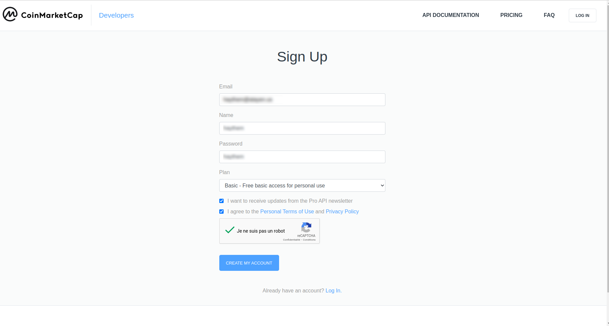


  # Get your crededentials

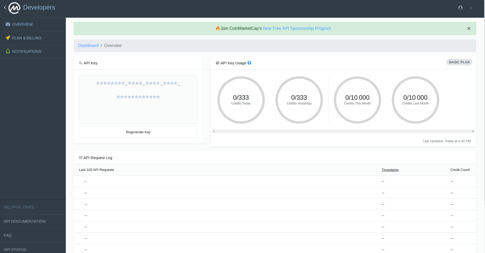
